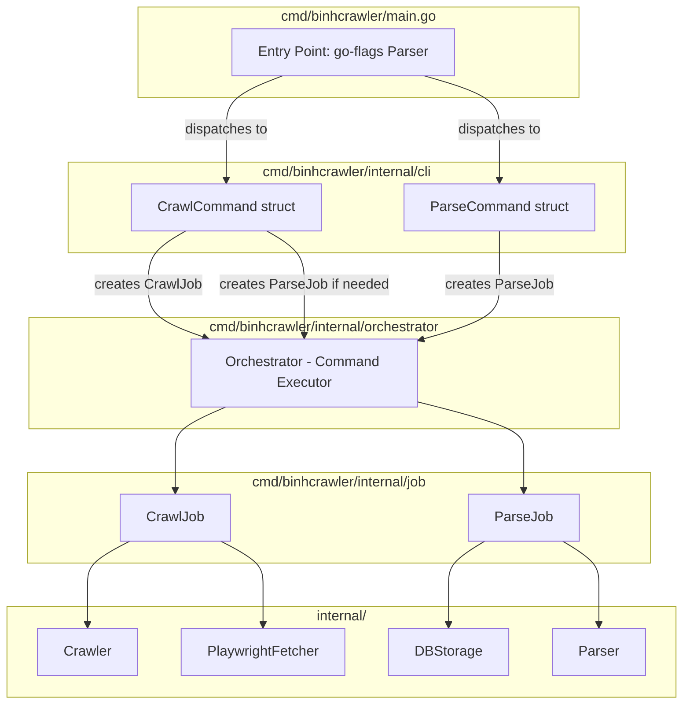

# Scheduler CLI Plan

## Overview

Convert the scheduler into a flexible CLI application using `github.com/jessevdk/go-flags` for subcommand support. The command directory is renamed from `scheduler` to `binhcrawler`.

## Goal

- **cmd/binhcrawler/** contains the terminal program that handles parsing commands (subcommands)
- **Orchestrator** is a command executor that issues crawl or parse jobs based on the subcommand invoked

## Current State Analysis

The current [`cmd/scheduler/main.go`](cmd/scheduler/main.go) uses hardcoded defaults:
- `defaultMaxDepth = 3`
- `defaultConcurrency = 10`
- `defaultBatchSize = 100`
- URL is hardcoded via [`GetSeekConfiguration()`](internal/fetcher/playwrightfetcher/seekplaywrightconfig.go:23) returning `https://www.seek.com.au/software-engineer-jobs`
- Orchestrator mode is hardcoded to `Sequential`

## Proposed CLI Usage

```bash
# Run both crawl and parse sequentially (default behavior)
go run cmd/binhcrawler/main.go

# Run only the crawl command
go run cmd/binhcrawler/main.go crawl --url "https://www.seek.com.au/developer-jobs" --max-depth 5

# Run only the parse command
go run cmd/binhcrawler/main.go parse --batch-size 50

# Run with specific mode
go run cmd/binhcrawler/main.go crawl --mode concurrent
```

## File Structure

```
cmd/
└── binhcrawler/                    # RENAMED from scheduler
    ├── main.go                     # Entry point: parse subcommands, dispatch to commands
    └── internal/
        ├── cli/                    # NEW: CLI command definitions using go-flags
        │   └── commands.go         # CrawlCommand, ParseCommand structs with flags
        ├── job/                    # Existing: Job interface, CrawlJob, ParseJob
        │   └── job.go
        └── orchestrator/           # Existing: Orchestrator for executing jobs
            └── orchestrator.go
```

## Architecture Diagram



## Command Definitions

### Global Options (shared across all commands)

| Flag | Short | Long | Type | Default | Description |
|------|-------|------|------|---------|-------------|
| LogLevel | `-l` | `--log-level` | string | `"info"` | Log level (debug, info, warn, error) |
| DryRun | `-d` | `--dry-run` | bool | `false` | Validate configuration without running |

### CrawlCommand (subcommand: `crawl`)

| Flag | Short | Long | Type | Default | Description |
|------|-------|------|------|---------|-------------|
| URL | `-u` | `--url` | string | `"https://www.seek.com.au/software-engineer-jobs"` | Target URL to crawl |
| MaxDepth | `-D` | `--max-depth` | int | `3` | Maximum crawl depth |
| Concurrency | `-c` | `--concurrency` | int | `10` | Number of concurrent crawls |
| Mode | `-m` | `--mode` | string | `"sequential"` | Execution mode (sequential, concurrent, independent) |
| Headless | - | `--headless` | bool | `true` | Run browser in headless mode |
| Query | `-q` | `--query` | string | `"Software Engineer Jobs"` | Search query |
| Timeout | `-t` | `--timeout` | int | `10000` | Playwright timeout in ms |
| ParseAfter | - | `--parse` | bool | `false` | Automatically run parse after crawl completes |

### ParseCommand (subcommand: `parse`)

| Flag | Short | Long | Type | Default | Description |
|------|-------|------|------|---------|-------------|
| BatchSize | `-b` | `--batch-size` | int | `100` | Batch size for DB inserts |
| StartDate | `-s` | `--start-date` | time.Time | current time - 1min | Start date for raw data query (UTC) |

## Implementation Steps

### Step 1: Add go-flags dependency
```bash
go get github.com/jessevdk/go-flags
```

### Step 2: Create `cmd/binhcrawler/internal/cli/commands.go`

```go
package cli

import (
    "context"
    "fmt"
    "log/slog"
    "os"
    "time"

    "github.com/jessevdk/go-flags"

    "golangwebcrawler/cmd/binhcrawler/internal/job"
    "golangwebcrawler/cmd/binhcrawler/internal/orchestrator"
    "golangwebcrawler/internal/crawler"
    "golangwebcrawler/internal/dbstore"
    "golangwebcrawler/internal/fetcher/playwrightfetcher"
    "golangwebcrawler/internal/storage"
    "golangwebcrawler/internal/typeutil"
    crawlerparser "golangwebcrawler/internal/crawlerparser"
)

// GlobalOpts holds options shared across all commands.
type GlobalOpts struct {
    LogLevel string `short:"l" long:"log-level" description:"Log level (debug, info, warn, error)" default:"info"`
    DryRun   bool   `short:"d" long:"dry-run" description:"Validate configuration without running"`
}

// CrawlCommand defines the 'crawl' subcommand.
type CrawlCommand struct {
    GlobalOpts `group:"Global Options"`

    URL         string `short:"u" long:"url" description:"Target URL to crawl" default:"https://www.seek.com.au/software-engineer-jobs"`
    MaxDepth    int    `short:"D" long:"max-depth" description:"Maximum crawl depth" default:"3"`
    Concurrency int    `short:"c" long:"concurrency" description:"Number of concurrent crawls" default:"10"`
    Mode        string `short:"m" long:"mode" description:"Execution mode (sequential, concurrent, independent)" default:"sequential"`
    Headless    bool   `long:"headless" description:"Run browser in headless mode" default:"true"`
    Query       string `short:"q" long:"query" description:"Search query" default:"Software Engineer Jobs"`
    Timeout     int    `short:"t" long:"timeout" description:"Playwright timeout in ms" default:"10000"`
    ParseAfter  bool   `long:"parse" description:"Automatically run parse after crawl completes"`
}

// Execute runs the crawl command.
func (c *CrawlCommand) Execute() error {
    // 1. Setup logger with configured log level
    // 2. Setup database connection
    // 3. Build PlaywrightFetcherConfig from flags
    // 4. Create CrawlJob with configured parameters
    // 5. If ParseAfter, also create ParseJob
    // 6. Parse Mode string to orchestrator.Mode
    // 7. Run orchestrator
}

// ParseCommand defines the 'parse' subcommand.
type ParseCommand struct {
    GlobalOpts `group:"Global Options"`

    BatchSize int           `short:"b" long:"batch-size" description:"Batch size for DB inserts" default:"100"`
    StartDate time.Time     `short:"s" long:"start-date" description:"Start date for raw data query (UTC)"`
}

// Execute runs the parse command.
func (c *ParseCommand) Execute() error {
    // 1. Setup logger with configured log level
    // 2. Setup database connection
    // 3. Use StartDate or default to current time - 1 minute
    // 4. Create ParseJob with configured parameters
    // 5. Run orchestrator with just the parse job
}
```

### Step 3: Refactor `cmd/binhcrawler/main.go`

```go
package main

import (
    "fmt"
    "os"

    "github.com/jessevdk/go-flags"

    "golangwebcrawler/cmd/binhcrawler/internal/cli"
)

func main() {
    var globalOpts cli.GlobalOpts
    var crawlCmd cli.CrawlCommand
    var parseCmd cli.ParseCommand

    parser := flags.NewParser(&globalOpts, flags.Default)
    parser.AddCommand("crawl", "Run the crawler", &crawlCmd)
    parser.AddCommand("parse", "Parse stored raw data", &parseCmd)

    if _, err := parser.Parse(); err != nil {
        os.Exit(1)
    }

    // If no subcommand given, run default (crawl + parse sequential)
    if parser.Active == nil {
        if err := runDefault(); err != nil {
            fmt.Fprintf(os.Stderr, "scheduler failed: %v\n", err)
            os.Exit(1)
        }
        return
    }

    switch active := parser.Active.(type) {
    case *cli.CrawlCommand:
        if err := active.Execute(); err != nil {
            fmt.Fprintf(os.Stderr, "crawl failed: %v\n", err)
            os.Exit(1)
        }
    case *cli.ParseCommand:
        if err := active.Execute(); err != nil {
            fmt.Fprintf(os.Stderr, "parse failed: %v\n", err)
            os.Exit(1)
        }
    }
}

func runDefault() error {
    // Original main.go logic: crawl + parse sequential
}
```

## Key Design Decisions

1. **go-flags library** — Uses `github.com/jessevdk/go-flags` which provides rich subcommand support, short flags, default values, and help text generation.

2. **Command structs** — Each subcommand (`CrawlCommand`, `ParseCommand`) is a struct with embedded flag fields. The `Execute()` method on each command handles the actual logic.

3. **Orchestrator as executor** — The existing [`orchestrator.Orchestrator`](cmd/scheduler/internal/orchestrator/orchestrator.go:28) remains unchanged. Commands create jobs and pass them to the orchestrator.

4. **Backward compatibility** — Running without subcommands executes the default behavior (crawl + parse sequential), matching current behavior.

5. **Shared global options** — `GlobalOpts` struct is embedded in both commands for shared flags like `--log-level`, `--dry-run`.

6. **Directory rename** — `cmd/scheduler` is renamed to `cmd/binhcrawler` to better reflect the tool's purpose as a CLI command runner.

## Constraints

- Do not change existing test files
- Do not modify `internal/` packages unless required
- All existing tests must pass after changes
- Run `golangci-lint run --fix` and `go test ./...` before considering task complete
