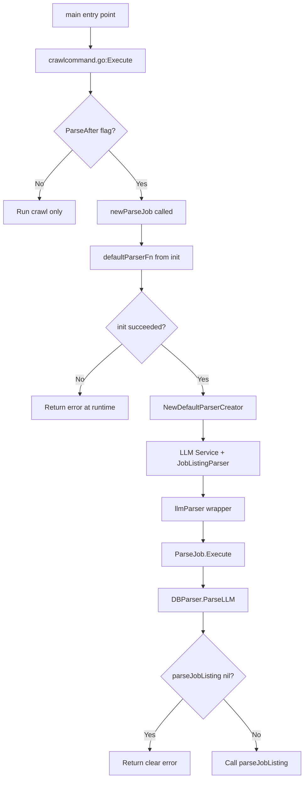

# Fix: parseJobListing Nil Guard & Default Parser

## Problem
[`DBParser.ParseLLM()`](cmd/binhcrawler/internal/job/job.go:203) calls `parseJobListing(ctx, p.db, html)` but [`parseJobListing`](cmd/binhcrawler/internal/job/job.go:209) is a nil function pointer by default. When `SetParseJobListing()` is never called, this causes a **nil function call panic (segfault)** at line 150 in [`executeParse()`](cmd/binhcrawler/internal/job/job.go:150).

The call chain is:
```
crawlcommand.go:newParseJob() (line 144)
  -> job.NewParseJob() with ParserFn = job.NewDBParserCreator(db) (line 148)
    -> DBParser.ParseLLM() calls parseJobListing(nil!) (line 203-204)
      -> PANIC at executeParse line 150
```

## Solution

### Step 1: Add nil guard in `DBParser.ParseLLM()` (cmd/binhcrawler/internal/job/job.go)

Replace line 203-205:
```go
func (p *DBParser) ParseLLM(ctx context.Context, html string) ([]models.ExtractedJobData, error) {
    return parseJobListing(ctx, p.db, html)
}
```

With:
```go
func (p *DBParser) ParseLLM(ctx context.Context, html string) ([]models.ExtractedJobData, error) {
    if parseJobListing == nil {
        return nil, fmt.Errorf("parser not initialized: call SetParseJobListing before executing parse jobs")
    }
    return parseJobListing(ctx, p.db, html)
}
```

### Step 2: Create `NewDefaultParserCreator()` in cmd/binhcrawler/internal/job/job.go

Add a new function that creates the default parser using `JobListingParser` with Ollama LLM:

```go
import (
    "golangwebcrawler/internal/llm"
    "golangwebcrawler/internal/parser"
)

// NewDefaultParserCreator returns a ParserFn that creates a JobListingParser using Ollama LLM.
func NewDefaultParserCreator() (func() (ParserJob, error), error) {
    llmService, err := llm.NewLLMService()
    if err != nil {
        return nil, fmt.Errorf("failed to create LLM service: %w", err)
    }

    inner := parser.NewJobListingParser(llmService)

    return func() (ParserJob, error) {
        return &llmParser{inner: inner}, nil
    }, nil
}

// llmParser wraps parser.JobListingParser to satisfy ParserJob interface.
type llmParser struct {
    inner parser.Parser[models.JobListing]
}

func (l *llmParser) ParseLLM(ctx context.Context, html string) ([]models.ExtractedJobData, error) {
    if typed, ok := l.inner.(*parser.JobListingParser); ok {
        return typed.ParseLLM(ctx, html)
    }
    return l.inner.ParseLLM(ctx, html)
}
```

### Step 3: Update `newParseJob()` in cmd/binhcrawler/commands/crawlcommand.go

Replace line 148:
```go
ParserFn:  job.NewDBParserCreator(db),
```

With:
```go
ParserFn:  defaultParserFn,
```

And add a package-level variable initialized at startup:
```go
var defaultParserFn func() (job.ParserJob, error)

func init() {
    var err error
    defaultParserFn, err = job.NewDefaultParserCreator()
    if err != nil {
        // Log but don't fatal — init() cannot exit gracefully.
        // The error will surface when parse job runs.
        fmt.Fprintf(os.Stderr, "Warning: failed to create default parser: %v\n", err)
    }
}
```

## Files to modify

| # | File | Change |
|---|------|--------|
| 1 | [`cmd/binhcrawler/internal/job/job.go`](cmd/binhcrawler/internal/job/job.go:203) | Add nil guard in `DBParser.ParseLLM()` + add `NewDefaultParserCreator()` and `llmParser` wrapper |
| 2 | [`cmd/binhcrawler/commands/crawlcommand.go`](cmd/binhcrawler/commands/crawlcommand.go:148) | Replace `job.NewDBParserCreator(db)` with `defaultParserFn` + add `init()` |

## Diagram



## Notes

- The `llmParser` wrapper is needed because `parser.JobListingParser` implements `parser.Parser[models.JobListing]`, not the `job.ParserJob` interface directly.
- Using `init()` ensures the parser is created once at package load time, before any jobs execute.
- If LLM service creation fails in `init()`, the error is stored and surfaces as a clear runtime error when parse jobs run.
